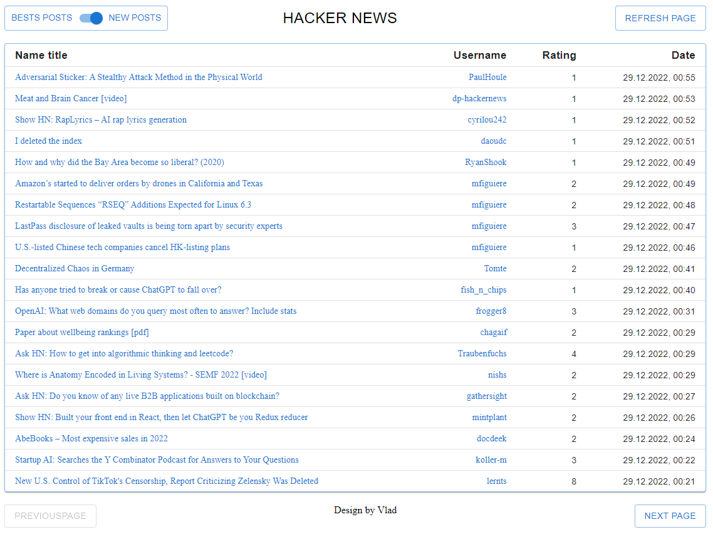
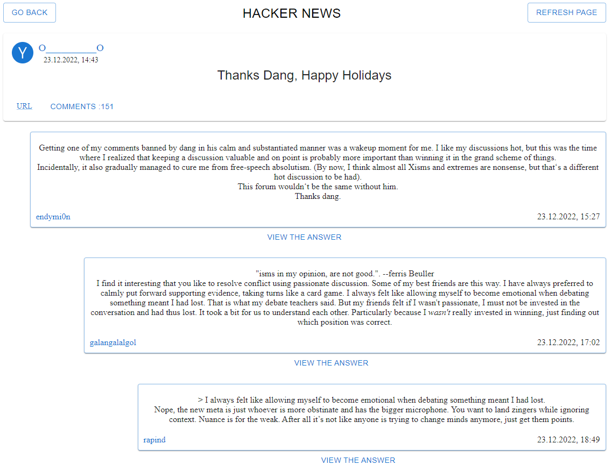
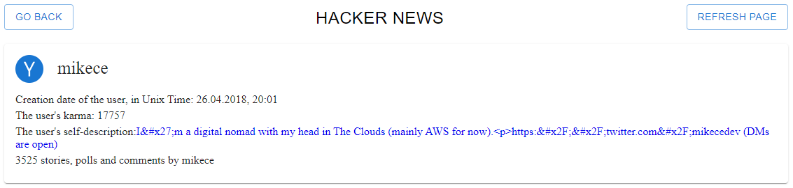

# Hacker news

Project: [hacker-news](https://vladzinovev.github.io/practice-hacker_news/).

**[Основная страница]** - первое что видит пользователь.



## Пользование сайтом

Мы можем выбрать любую новость и перейти на нее (смотрите следующий рисунок).
Также можо перемещатья по новостям вперед (next page) и назад (previous page). Я Добавил обнолвение страницы (refresh page).
Есть возмодность просматривать самые последние новости или же самые популярные с помощью переключателя вверхнем левом углу (bests posts/new posts).


**[Страница с новостью]** 



## Страница новости

На данной странице можно перейти по ссылке (URL) с новостью на стороннний сайт, перейти на страницу автора публикации нажам на никнейм автора, открыть комментарии под новотью. Так же можем обновить страницу и перейти назад.

**[Страница автора]** 



## Страница автора

На странице автора видим дату создания аккаунта, сколько у него кармы, дополнительная необязательная биография автора на стороннем сайте, а так же количество комментариев и новостей, сделанных автором. 

## Стек технологий

```
React
Redux
TypeScript
Axios
```


